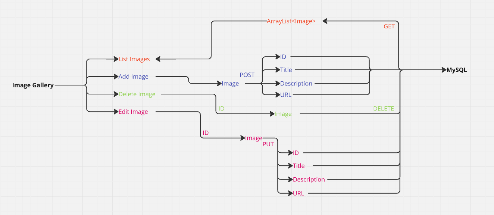

# IMAGE GALLERY

 

## Development Description

It is developed in JAVA Backend component that allows the user to manage an image gallery. Users can upload and view images, edit an image, or delete it.

## Expected Features:

### CRUD

**Create:** Allows you to add images to the database.
- **Read:** Allows you to view a list of images (image and title). 
- **Update:** Allows you to edit an existing image.
- **Delete:** Allows you to delete images from the database.

### MVC
Implementation of inheritance, MVC, Dependency Injection, encapsulation to hide the internal implementation of classes and protect data.

 

## PROJECT DIAGRAM

 

### KANBAN
- https://trello.com/b/M0rbZOUl/image-gallery

 

### 👥 Collaborators

- https://github.com/miangels1978
- https://github.com/FJRJ3D
- https://github.com/israelcs13
- https://github.com/Jrdevangel